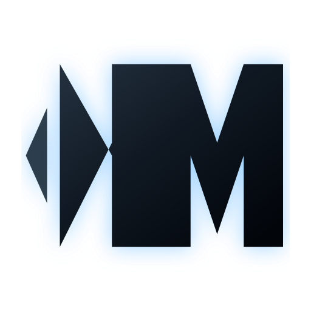

<p align="center">
  
</p>

<h1 align="center">NovaWay Matrix</h1>

<p align="center"><b>One sentence, and AI writes your code, builds your slides, and ships your posts.</b></p>

<p align="center">An AI coding and office-automation agent in your terminal — built for Chinese LLMs and Chinese workflows.</p>

<p align="center">
  <a href="https://www.npmjs.com/package/xymt-novaway"></a>
  
  
</p>

<p align="center">
  <a href="README.md">简体中文</a> |
  <b>English</b>
</p>

---

## One command, two worlds

```bash
npm install -g xymt-novaway
novaway
```

What you get is more than "a chat box in the terminal":

- **Code**: it reads your project, edits your files, runs your tests — from requirement to commit, end to end.
- **Office**: slides, weekly reports, spreadsheet analysis and marketing copy from a single sentence.
- **Projects**: Git staging and commits, branch management, database queries — all in the same interface.
- **Chinese, natively**: DeepSeek, Qwen, Zhipu GLM and Kimi work out of the box, in a fully Chinese UI.

The same core also powers an **Electron desktop app** and a **floating desktop pet** (see below).

> Supports **Windows x64** / **macOS** (Apple Silicon and Intel) / **Linux x64**, requires Node.js ≥ 18. npm installs only the binary matching your platform.

### Faster installs in mainland China

The platform binaries ship through npm, and each platform package is about **180 MB**. The official registry is often only tens of KB/s from China and will time out. Because the platform packages are `optionalDependencies`, **npm silently skips one that fails to download** — postinstall then reports `Try manually installing xymt-novaway-<os>-<arch>` and npm rolls the whole install back. It looks like a broken package, but it is just a slow network. Use the npmmirror registry:

```bash
npm install -g xymt-novaway --registry=https://registry.npmmirror.com --foreground-scripts
```

`--foreground-scripts` merely surfaces the postinstall output so you can confirm the binary was unpacked (optional). To make the mirror permanent:

```bash
npm config set registry https://registry.npmmirror.com
```

If the mirror 404s or serves a stale version it has not synced yet — trigger a sync and retry after about a minute:

```bash
curl -X PUT "https://registry-direct.npmmirror.com/-/package/xymt-novaway/syncs"
curl -X PUT "https://registry-direct.npmmirror.com/-/package/xymt-novaway-windows-x64/syncs"
```

> Replace `windows-x64` in the second command with your platform: `darwin-arm64` / `darwin-x64` / `linux-x64`.

### Other package managers

```bash
pnpm add -g xymt-novaway
yarn global add xymt-novaway
bun add -g xymt-novaway
```

> `pnpm` does not run postinstall scripts by default. If `novaway` reports `postinstall script was not run`, run it manually:
> `cd $(pnpm root -g)/xymt-novaway && node postinstall.mjs`

Verify with `novaway --version`, then run `novaway` to start.

## Terminal TUI: a full workbench, not just a chat box

Run `novaway` and you'll see a width-adaptive side panel — **five tabs** that put the whole development pipeline inside your terminal:

**Files** — the project tree at your fingertips: click to preview, edit in place with line numbers and auto-save, then let the agent pick up where you left off.

**Info** — tokens, cost and cache hit rate for the current session at a glance; live MCP and LSP connection status; click any message in the message list and the chat jumps right back to that moment.

**Git** — the Git workflow people said couldn't feel good in a terminal:

- What changed and what's staged, in two clean groups; stage per file, or stage-everything-and-commit in one click.
- Type the commit message right in the panel and press enter. Slip up? Undo the last commit — changes come back untouched.
- Push, pull, switch branches, create branches, stash your work — each one click away.
- Maintaining several remotes? Hook up GitHub and Gitee and click to choose where you push and pull.
- Click any commit for author, time and the changed-file list; click a changed file to unfold a syntax-highlighted, line-by-line diff.

**Database** — a built-in visual database client: fill in a short dialog to connect to MySQL / PostgreSQL / SQLite / Redis and more (eight engines), browse down to each column's type and comment, open a table to preview its first 100 rows, type SQL and press enter for results. You and the agent share the same connections.

**Hub** — the agent's "self-management" dashboard: persistent memory, evolution, checkpoints, goals, workflows and multi-agent orchestration, auto-refreshing in collapsible sections — like watching it organize its own work.

The chat area supports **multiple tabs** (chat / file preview / diff side by side); `ctrl+p` opens the command palette, `ctrl+alt+k` lists all shortcuts, and `f2` cycles recently used models in an instant.

## Desktop app

Not a terminal person? NovaWay also ships an **Electron desktop app** (not a thin wrapper) driving the same `novaway` core as a sidecar, with a Chinese UI, 16 languages and auto-update:

**① Workbench window** — the full main window for coding and office conversations; custom server address, deep-link activation, and WSL configuration on Windows.

**② Floating pet** — an AI companion that lives on your desktop, follows your cursor and is always one click away:

- **Two forms**: full and minimal, toggled instantly.
- **Expand to see**: the task monitor (what the agent is doing right now) plus a notification center.
- **Skins**: several built-in pet skins, custom colors supported.

### Multi-platform accounts and one-click publishing

The desktop app manages login sessions for major Chinese content platforms and automates publishing, closing the loop with the built-in skills — "generate content → publish":

> Xiaohongshu, Douyin, Kuaishou (with signing), Bilibili, WeChat Official Accounts, WeChat Channels, Xianyu

- **QR / web login** with automatic session capture and validation, batch expiry checks included.
- **Account grouping** — create, edit and delete groups; move accounts between them.
- **One-click publish** to any logged-in account — after the copy is written, publishing is one click away.

## Why NovaWay

- **Chinese LLMs out of the box** — DeepSeek, Qwen, Zhipu GLM, Kimi, MiniMax and Xiaomi MiMo each ship with dedicated system prompts: pick a provider, paste the key, start working. Claude, GPT and Gemini work just as well.
- **Chinese everywhere** — terminal, desktop app, command palette, error messages, all localized with NovaWay branding.
- **Office skills you can speak to** — PPT (office-ppt), Xiaohongshu ops, WeChat Official Account ops, plus a full document / data / meeting / design / web suite. Describe what you want in plain language.
- **Multi-agent orchestration** — the Orchestrator breaks big tasks into dependency-aware plans, spawns subagents concurrently in topological order and threads results between them; the pulse-orchestrator ops agent actively drives it for multi-step campaigns.
- **Session intelligence** — goals, checkpoints and distillation: the agent remembers, rewinds and reviews itself.
- **Git integration** — staging, commits, branches, stashes, remote sync and diff viewing, complete in the terminal.
- **Database management** — multiple connections, tree browsing and SQL queries across the TUI, desktop app and web UI.
- **MCP ecosystem** — context7 (live docs), sequential-thinking, memory, browser and desktop-commander, preconfigured.

## Built-in agents: a team, each with a craft

Press `Tab` to switch primary agents, like assigning work to a team:

### Development

- **build** — the default workhorse: reads, writes, runs and verifies, delivering the task end to end.
- **plan** — a read-only strategist: explores first, proposes a plan, asks before touching anything.

### Office mode

Specialist "coworkers", one per everyday scenario:

- **Documents** — weekly reports and proposals in, polished deliverables out.
- **Presentations** — topic to page-level storyline, straight to a `.pptx` with the PPT skill.
- **Spreadsheets** — CSV / Excel cleanup, pivots and trend attribution; raw tables become conclusions.
- **Visual design** — posters, covers, illustrations and brand palettes, consistently styled.
- **Web dashboards** — usable HTML dashboards and demo sites with zero frontend work.
- **Meetings** — minutes, decisions and action items with owners; a meeting becomes an executable checklist.
- **Knowledge base** — summaries, comparisons, indexes and FAQs; project knowledge compounds.
- **Tasks** — goal breakdown, priorities, weekly plans and risk boards; vague goals get a rhythm.
- **Communication** — email, announcements and business phrasing with the right tone.

### Operations

- **Ops orchestrator** (pulse-orchestrator) — the content-operations control room: reads your intent, then plans and coordinates subagents step by step.

There are also **general** / **explore** / **scout** subagents, invoked internally by primary agents or with `@`, for complex search, codebase exploration and external research.

## Quick start

1. `novaway`
2. Pick a model, paste the key.
3. Start talking: read code, fix bugs, build a deck, plan a campaign — leave the rest to it.

## Update

```bash
novaway upgrade              # upgrade to the latest version
novaway upgrade 0.1.5        # upgrade to a specific version
```

It detects how you installed (npm / pnpm / bun / yarn / brew / scoop / choco) and **honors your npm registry config** — if you set the npmmirror registry, upgrades use it too. Force a method with `-m`: `novaway upgrade -m npm`.

Reinstalling works just as well:

```bash
npm install -g xymt-novaway@latest --registry=https://registry.npmmirror.com
```

## Uninstall

```bash
novaway uninstall              # list what will be removed, then confirm
novaway uninstall --dry-run    # preview only, delete nothing
novaway uninstall -f           # skip confirmation
novaway uninstall -c -d        # keep config (-c) and session data (-d)
```

To remove only the program and leave all data untouched, use your package manager directly:

```bash
npm uninstall -g xymt-novaway
# or pnpm uninstall -g xymt-novaway / yarn global remove xymt-novaway / bun remove -g xymt-novaway
```

User data directories (cleared by `novaway uninstall`, untouched by a manual uninstall):

| Purpose | Linux / macOS | Windows |
| --- | --- | --- |
| Config | `~/.config/novaway` | `C:\Users\<you>\.config\novaway` |
| Data (sessions / logs / snapshots) | `~/.local/share/novaway` | `C:\Users\<you>\.local\share\novaway` |
| Cache | `~/.cache/novaway` | `C:\Users\<you>\.cache\novaway` |
| State | `~/.local/state/novaway` | `C:\Users\<you>\.local\state\novaway` |

## Install troubleshooting

**`failed to install the right novaway CLI package` / `Try manually installing xymt-novaway-<os>-<arch>`**

The 180 MB platform binary timed out mid-download; npm skipped it silently because it is optional, postinstall then failed and the install rolled back. Reinstall through the npmmirror registry (see above). You can also warm the npm cache with the big package first:

```bash
npm cache add xymt-novaway-windows-x64@latest --registry=https://registry.npmmirror.com
npm install -g xymt-novaway --registry=https://registry.npmmirror.com
```

**`postinstall script was not run`**

You used `--ignore-scripts`, or a package manager that skips postinstall by default. Run it manually: `cd <global node_modules>/xymt-novaway && node postinstall.mjs`.

**The install hangs**

Check whether it is still fetching the 180 MB package (`--foreground-scripts` shows progress). If the official registry is simply too slow, interrupt it and switch to the mirror; run `npm uninstall -g xymt-novaway` first to clear the half-finished install.

## Build from source

Requires [Bun](https://bun.sh).

```bash
bun install
cd packages/novaway
bun run build --single   # current platform only (fast smoke build)
bun run build            # cross-compile all platforms
```

Output lands in `packages/novaway/dist/<platform-package>/bin/novaway`.

## License

[MIT](./LICENSE)
