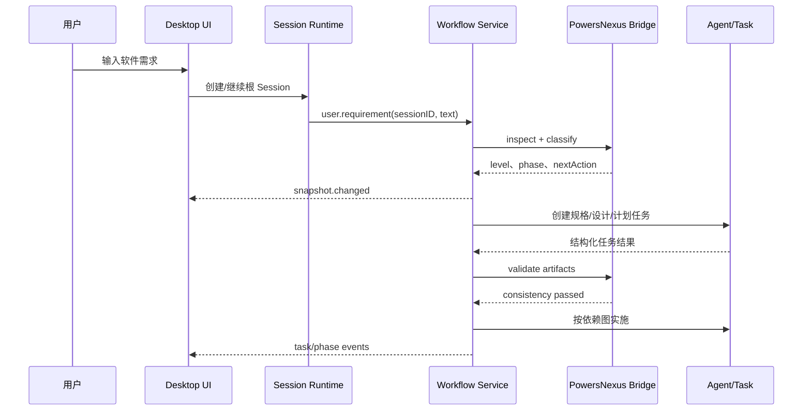
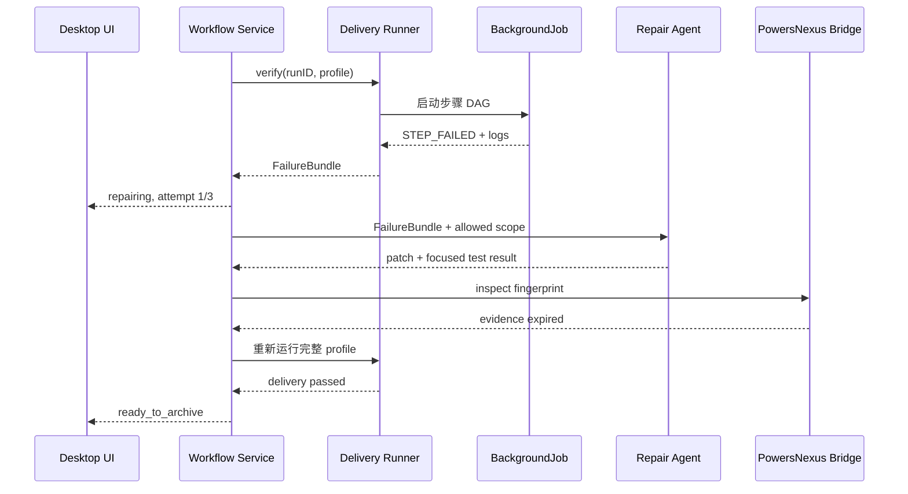
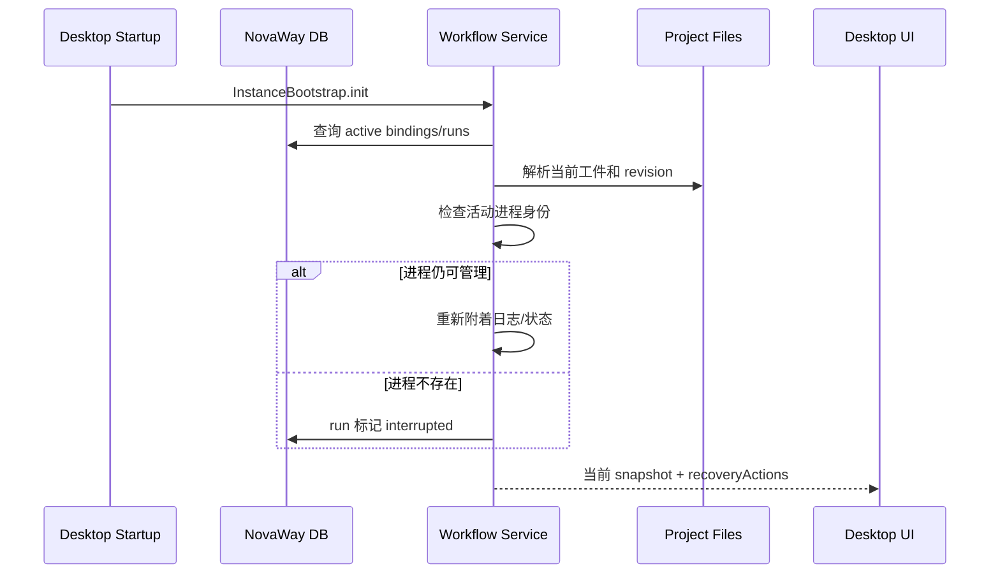

# 产品需求与工程实施规格：NovaWay Coder × PowersNexus 第一方工作流集成

**版本**：1.3
**日期**：2026-07-16
**文档状态**：可实施基线
**目标仓库**：`E:\AImoney\NovaWay-Matrix\novaway-coder`
**流程仓库**：`E:\AImoney\PowersNexus`
**需求质量评分**：98/100
**目标读者**：NovaWay Coder 后端、桌面端、前端、Agent Runtime、QA 与发布团队

---

## 1. 执行摘要

NovaWay Coder 已具备完整编码 Agent 所需的大部分运行能力：多模型 LLM 路由、会话循环、工具调用、权限请求、Skill、MCP、子代理、后台任务、上下文压缩、文件快照、撤销恢复、Worktree、桌面 UI 与通知。PowersNexus 已具备从需求分级、规格、设计、计划、TDD、审查，到真实构建、测试、运行验证、交付报告和归档的标准化流程。

当前问题不是缺少能力，而是两套能力尚未成为同一个系统。NovaWay Coder 目前仅把 PowersNexus 作为默认 Git 插件加入配置；桌面端、Session、Todo、Task、BackgroundJob、Snapshot 与 `.novaway/powersnexus/` 工件之间没有正式协议。流程推进仍依赖模型阅读技能后自行决定下一步，用户也无法在桌面端直接看到流程状态、阻塞原因、验证日志和最终交付成果。

本项目要新增一个第一方 `PowersNexus Workflow Service`，使 PowersNexus 成为 NovaWay Coder 的确定性工作流层，而 NovaWay Coder 继续作为唯一 Agent Runtime。完成后，用户输入一个软件需求，系统可以在授权边界内连续完成：

```text
需求输入
→ 仓库与风险分析
→ L0-L4 分级
→ 规格/设计/计划
→ Worktree 与 Session 绑定
→ Agent/子代理实施
→ 任务与 REQ 自动同步
→ 构建/测试/集成/运行验证
→ 浏览器视觉与交互验收
→ 失败自动修复重试
→ 可读交付报告
→ 主规格合并与归档
→ 桌面端呈现可运行成果
```

本规格不要求重新开发模型、会话循环或工具系统，也不允许在 PowersNexus 内复制 NovaWay Coder 已有运行能力。

> **现状与目标必须区分**：PowersNexus 侧 Bridge v1、协议/Profile/更新 Manifest Schema、确定性 ZIP 构建和 Ed25519 签名脚本已实现；NovaWay Coder 侧 Workflow Service、Bridge Client、独立更新器、Browser QA 和工作流 UI 尚未实现。当前 NovaWay 仍以未固定的 Gitee Git 插件配置加载 PowersNexus。团队必须先按 35 章完成 NovaWay Phase 0，不能把 PowersNexus 已提供的协议误认为桌面端已经完成集成。

---

## 2. 问题陈述

### 2.1 当前情况

1. NovaWay Coder 在 `packages/opencode/src/config/config.ts` 中默认安装 PowersNexus Git 插件。
2. PowersNexus 在启动时向模型注入流程说明，并通过技能引导模型使用 CLI。
3. NovaWay Coder 不读取或展示 `.novaway/powersnexus/` 的结构化状态。
4. PowersNexus 的 `tasks.md`、checkpoint 与 delivery 状态没有绑定 NovaWay Session、Todo、Task 或 BackgroundJob。
5. PowersNexus 交付命令通过同步子进程执行，未复用 NovaWay 的取消、后台运行、通知与日志能力。
6. Browser Tool 在 NovaWay 工具注册器中尚未启用，前端视觉验收无法形成确定性闭环。
7. 当前测试只覆盖默认插件配置，没有覆盖打包桌面端中的真实端到端流程。

### 2.2 用户痛点

- 用户无法知道当前处于需求、计划、实施、验证还是归档阶段。
- 用户无法区分“Agent 还在工作”“等待权限”“测试失败”“流程已阻塞”。
- 会话 Todo 完成后仍可能需要人工更新 PowersNexus 文档。
- 上下文压缩、会话恢复或 Worktree 切换后，流程状态可能与对话状态不一致。
- 构建、测试和运行验证只能看到终端输出，无法获得结构化进度和历史日志。
- 前端项目可能测试通过但页面不可用或视觉质量不合格。
- PowersNexus 版本存在远程 Git、回退上游和桌面资源副本多源漂移风险。

### 2.3 建议方案

在 NovaWay Coder 后端新增第一方工作流服务，以 `.novaway/powersnexus/` 为工程事实来源，以 NovaWay 数据库保存会话绑定和运行态，以 HTTP API/Event Bus 提供统一读写接口，并将工作流执行映射到已有 Agent、Task、BackgroundJob、Permission、Snapshot 和桌面 UI。

---

## 3. 成功指标

### 3.1 主要 KPI

| 指标                   | 发布门槛           | 测量方式                                   |
| ---------------------- | ------------------ | ------------------------------------------ |
| 端到端本地交付成功率   | 标准样板任务 ≥ 85% | 固定基准集重复执行 20 次                   |
| 无人工阶段衔接率       | ≥ 90%              | 除需求澄清和权限外不要求用户输入“继续”     |
| 状态恢复正确率         | 100%               | 在每个阶段强制退出应用后恢复               |
| 工件与 Session 一致率  | 100%               | REQ、任务、运行步骤的双向一致性测试        |
| 失败可诊断率           | 100%               | 每个失败必须有错误类型、日志路径和恢复动作 |
| 交付证据完整率         | 100%               | 构建、测试、运行、视觉证据均满足 Profile   |
| PowersNexus 加载成功率 | 100%               | 打包应用首次启动、升级、离线启动测试       |
| 严重权限越界           | 0                  | 权限和目录隔离对抗测试                     |

### 3.2 性能指标

- 工作流状态 API 的 P95 响应时间小于 200ms，不包含外部命令执行。
- 文件变更后 500ms 内向前端发布聚合状态更新。
- 10,000 个任务项下状态重算小于 1 秒。
- 单个项目最多保留 100 次工作流运行摘要；完整日志按配置清理。
- UI 首次打开工作流面板不阻塞 Session 时间线渲染。

---

## 4. 用户角色

### 4.1 主要用户：产品/项目发起人

- 目标：只描述需求并获得可运行成果。
- 痛点：不理解 Git、测试命令、规格文件和 Agent 内部状态。
- 期望：看到当前进度、需要自己决定的事项、最终运行入口和交付报告。

### 4.2 开发用户

- 目标：利用 Agent 加速真实代码开发，同时保留控制和审计能力。
- 痛点：流程文档、Session Todo、Git Worktree 和测试结果相互割裂。
- 期望：可查看、暂停、重试、接管、回退和修改每个阶段。

### 4.3 团队管理员

- 目标：统一模型、权限、流程级别、交付门槛和插件版本。
- 痛点：远程插件漂移、不同机器行为不一致、缺少成功率数据。
- 期望：固定版本、策略配置、审计记录和基准结果。

### 4.4 QA/审查人员

- 目标：证明成果真实可用。
- 期望：从 REQ 查看实现、测试、运行日志、截图、浏览器交互和最终指纹。

---

## 5. 范围与非目标

### 5.1 本期必须完成

- PowersNexus 单一版本与离线可用分发。
- 第一方工作流服务、状态机和 Schema。
- Project/Worktree/Session/Change 稳定绑定。
- REQ、Task、Todo、Agent Task 同步。
- 后台交付执行器、日志、取消、重试和恢复。
- 浏览器工具和视觉/交互验收。
- 工作流中心 UI。
- 权限、外部动作和自动本地交付边界。
- 失败自动修复闭环。
- API、事件、SDK 与迁移。
- 打包桌面端端到端测试和基准评测。

### 5.2 非目标

- 不重新开发 LLM Provider 或通用 Session Prompt 循环。
- 不在 PowersNexus 中实现第二套权限、Todo、后台任务或数据库。
- 不承诺替代 Codex 的专有云端任务基础设施。
- 不自动执行部署、推送、PR、付费、账号、密钥或不可逆外部操作。
- 不以 Markdown 文件数量作为流程质量指标。
- 不允许仅用 Prompt 声明“已集成”而缺少程序级状态和测试。

---

## 6. 设计原则

1. **单一事实来源**：项目事实存放在 `.novaway/powersnexus/`；数据库只保存绑定、运行态和索引。
2. **单一 Agent Runtime**：所有模型、工具、权限、子代理、后台任务与取消均复用 NovaWay Coder。
3. **事件驱动**：文件、Session、Todo、Task、权限和运行结果通过事件推进，不依赖用户反复输入“继续”。
4. **可恢复**：每个状态转换可重放；应用重启后能识别上次运行是完成、失败还是中断。
5. **可解释**：每次推荐、阻塞、自动操作和失败都有 reason code 与证据。
6. **默认安全**：本地可逆动作可按授权自动执行；外部或不可逆动作必须明确授权。
7. **版本确定**：生产构建不得在首次启动时下载未固定提交的工作流代码。
8. **无静默降级**：PowersNexus 缺失、版本不匹配或 Browser 不可用时必须展示能力缺口。
9. **机器协议优先**：NovaWay 不解析 CLI 的人类可读 stdout；集成只能使用版本化 JSON/API。
10. **渐进流程**：L0/L1 不产生完整 OpenSpec 工件；L2+ 才进入完整闭环。

---

## 7. 现有能力与复用点

| 能力             | 现有实现                                                  | 集成用途                               |
| ---------------- | --------------------------------------------------------- | -------------------------------------- |
| Agent 定义与权限 | `packages/opencode/src/agent/agent.ts`                    | 工作流主 Agent、审查 Agent、修复 Agent |
| 子代理           | `packages/opencode/src/tool/task.ts`                      | 计划任务执行、两阶段审查               |
| 后台任务         | `packages/opencode/src/background/job.ts`                 | 构建、测试、浏览器验收                 |
| 会话运行与取消   | `packages/opencode/src/session/prompt.ts`、`run-state.ts` | 连续推进、用户中断                     |
| 自动压缩         | `packages/opencode/src/session/compaction.ts`             | 长任务上下文恢复                       |
| 文件快照与回退   | `packages/opencode/src/snapshot/`、`session/revert.ts`    | 失败恢复与用户撤销                     |
| 工具注册         | `packages/opencode/src/tool/registry.ts`                  | PowersNexus 工具、Browser Tool         |
| Skill            | `packages/opencode/src/skill/`                            | 流程技能加载                           |
| Permission       | `packages/opencode/src/permission/`                       | 自动交付授权和外部动作边界             |
| MCP/OAuth        | `packages/opencode/src/mcp/`                              | 外部连接器                             |
| HttpApi          | `packages/opencode/src/server/routes/instance/httpapi/`   | 工作流 API 与 SDK 生成                 |
| 数据库           | `packages/opencode/src/**/*.sql.ts`                       | 绑定与运行历史                         |
| 前端状态同步     | `packages/app/src/context/global-sync/`                   | 实时工作流事件                         |
| Session UI       | `packages/app/src/pages/session/`                         | 工作流侧栏、日志与交付报告             |
| Electron IPC     | `packages/desktop/src/main/ipc.ts`                        | 仅桌面专属浏览器/文件能力              |

---

## 8. 目标架构

```text
┌──────────────────────────────── NovaWay Desktop ────────────────────────────────┐
│ Session Timeline │ Workflow Center │ Run Logs │ Evidence/Preview │ Permissions │
└───────────────────────────────┬─────────────────────────────────────────────────┘
                                │ generated SDK + event stream
┌───────────────────────────────▼─────────────────────────────────────────────────┐
│                         NovaWay Agent Runtime                                    │
│ Session │ Agent │ Task │ Todo │ BackgroundJob │ Permission │ Snapshot │ MCP     │
└───────────┬───────────────────────┬───────────────────────────┬───────────────────┘
            │                       │                           │
┌───────────▼────────────┐ ┌────────▼───────────┐ ┌────────────▼──────────────┐
│ PowersNexus Workflow   │ │ Delivery Runner    │ │ Browser QA Service        │
│ Service                │ │ build/test/run     │ │ CDP/Playwright            │
│ state/reconcile/policy │ │ logs/cancel/retry  │ │ DOM/screenshot/a11y       │
└───────────┬────────────┘ └────────┬───────────┘ └────────────┬──────────────┘
            │                       │                           │
┌───────────▼───────────────────────▼───────────────────────────▼───────────────────┐
│ Project Worktree                                                                  │
│ .novaway/powersnexus │ source/tests │ delivery artifacts │ visual evidence       │
└──────────────────────────────────────────────────────────────────────────────────┘
```

### 8.1 新增后端模块

在 `packages/opencode/src/powersnexus/` 新增：

```text
powersnexus/
├── schema.ts              # Effect Schema：协议对象、枚举、错误
├── paths.ts               # 规范化路径，禁止目录穿越
├── parser.ts              # 读取版本化机器工件
├── state.ts               # 纯状态归约与转换规则
├── policy.ts              # L0-L4、权限、重试和外部动作策略
├── binding.sql.ts         # Change 与 Session/Worktree 绑定
├── run.sql.ts             # 工作流运行和步骤历史
├── repository.ts          # DB 持久层
├── watcher.ts             # 文件监听和去抖重算
├── reconcile.ts           # 文件、Todo、Task、Session 一致性协调
├── runner.ts              # BackgroundJob/ChildProcess 驱动交付步骤
├── browser-qa.ts          # 浏览器验收编排，不实现底层浏览器协议
├── service.ts             # Effect Service 公共接口
├── events.ts              # Bus 事件定义
└── index.ts               # 仅当该目录作为单一命名空间时自导出
```

必须遵循现有 Effect 约定：`Effect.fn`、`InstanceState`、Effect FileSystem、ChildProcessSpawner、Schema 错误和作用域清理。不得使用新的全局单例或无上下文 Promise 缓存。

### 8.2 PowersNexus Bridge 协议

PowersNexus 已提供以下稳定机器协议：

```text
powersnexus bridge inspect --change <name> --format json
powersnexus bridge transition --change <name> --format jsonl [--request <action.json>]
powersnexus bridge validate --change <name> --format json
```

`transition` 的 Action JSON 默认从 stdin 读取，`--request` 只用于本地调试。NovaWay 必须通过 stdin 传入请求，不能创建包含敏感内容的临时请求文件。NovaWay 只能消费 stdout 的版本化 JSON/JSONL；结构化错误写 stderr。禁止解析 Emoji、中文提示或 Markdown 表格。

`inspect` 的 stdout 是一个 `BridgeArtifactSnapshot`，不是包裹在 `result` 中的旧式信封：

```json
{
  "protocolVersion": "1.0",
  "powersnexusVersion": "6.1.0",
  "changeName": "example",
  "phase": "implementing",
  "status": "running",
  "revision": 123,
  "artifactDigest": "<sha256>",
  "requirements": [],
  "tasks": [],
  "blockers": [],
  "nextAction": "start_implementation",
  "delivery": null,
  "updatedAt": "2026-07-16T00:00:00.000Z"
}
```

`transition` stdout 为 JSONL，第一行为 `action.started`，成功时最后一行为 `action.completed`。失败时退出码非零，stderr 为单个结构化错误对象。退出码固定为：`0` 成功、`2` 请求非法、`3` revision/状态冲突、`4` Change 不存在、`5` 未分类内部错误。

Bridge v1 只直接执行属于工件层的 `configure_delivery` 和 `verify` 证据写回；`classify`、`clarify`、`create_artifacts`、`create_plan`、`start_implementation`、`repair`、`archive` 等动作由 NovaWay Workflow Service、Agent Runtime 或既有人工 CLI 协调。NovaWay 不得因为 Bridge 返回 `nextAction` 就假定该动作能由 `bridge transition` 直接执行。

幂等语义以 `actionID` 和完整请求摘要为准：相同 ID 与相同请求返回 `replayed: true`；相同 ID 对应不同请求返回 `REVISION_CONFLICT`。`revision` 是工件内容摘要派生的安全整数，只用于相等性比较，不保证单调递增；完整并发身份使用 `artifactDigest`。NovaWay 通过子进程取消能力终止尚未完成的 Bridge 调用，Bridge 不建立第二套取消系统。

---

## 9. 工作流数据模型

### 9.1 Change Snapshot

PowersNexus Bridge 返回的是工件层快照；NovaWay Workflow Service 将它与数据库、Session 和 Runner 状态聚合后，才形成桌面端使用的 `WorkflowSnapshot`。两者不能共用一个 Schema 名称或强制字段集合。

```ts
type BridgeArtifactSnapshot = {
  protocolVersion: "1.0"
  powersnexusVersion: string
  changeName: string
  level: "L0" | "L1" | "L2" | "L3" | "L4" | null
  phase:
    | "needs_proposal"
    | "needs_spec"
    | "needs_design"
    | "needs_plan"
    | "implementing"
    | "needs_traceability"
    | "needs_delivery_config"
    | "ready_to_verify"
    | "ready_to_archive"
    | "completed"
  status: "ready" | "running" | "blocked" | "completed"
  revision: number
  artifactDigest: string
  requirements: Array<{ id: string; module: string }>
  tasks: Array<{ id: string; title: string; status: "pending" | "completed" }>
  blockers: WorkflowBlocker[]
  nextAction: string | null
  delivery: object | null
  updatedAt: string
}
```

NovaWay 聚合对象为：

```ts
type WorkflowSnapshot = {
  protocolVersion: "1.0"
  powersnexusVersion: string
  projectRoot: string
  worktree: string
  changeName: string
  profile?: "application" | "library" | "web"
  level: "L0" | "L1" | "L2" | "L3" | "L4"
  phase: WorkflowPhase
  status: "idle" | "running" | "blocked" | "failed" | "completed-local" | "completed"
  revision: number
  requirements: RequirementState[]
  tasks: WorkflowTask[]
  delivery?: DeliveryState
  nextAction?: WorkflowAction
  blockers: WorkflowBlocker[]
  updatedAt: string
}
```

本协议中被引用的最小公共类型定义如下；实现时必须进入同一份 Effect Schema 和生成的 OpenAPI，不得由前后端各自复制：

```ts
type WorkflowPhase =
  | "uninitialized"
  | "needs_classification"
  | "needs_clarification"
  | "needs_specification"
  | "needs_design"
  | "needs_plan"
  | "ready_to_implement"
  | "implementing"
  | "needs_traceability"
  | "needs_delivery_config"
  | "ready_to_verify"
  | "verifying"
  | "repairing"
  | "ready_to_archive"
  | "archiving"
  | "completed"
  | "blocked"

type RequirementState = {
  id: string
  module: string
  status: "planned" | "implementing" | "verified" | "blocked"
  implementationFiles: string[]
  testFiles: string[]
}

type WorkflowTask = {
  id: string
  requirementIDs: string[]
  title: string
  status: "pending" | "in_progress" | "completed" | "cancelled" | "blocked"
  dependsOn: string[]
  sessionID?: string
}

type WorkflowAction = {
  action: string
  label: string
  automatic: boolean
  requiresAuthority?: "user" | "admin" | "external-system"
}

type DeliveryState = {
  profile: string
  status: "unconfigured" | "ready" | "running" | "failed" | "passed" | "expired"
  activeRunID?: string
  verifiedAt?: string
  fingerprint?: string
}
```

### 9.2 稳定标识

- `projectID`：复用 NovaWay ProjectID。
- `worktree`：规范化真实绝对路径。
- `changeName`：只允许 `[a-z0-9][a-z0-9._-]{0,79}`。
- `bindingID`：数据库生成的 ULID。
- `requirementID`：首期兼容 `REQ-数字`，协议字段不得限制未来自定义编号。
- `workflowTaskID`：工件内持久 ID，不得使用 Markdown 行号。
- `sessionID`：一个 Change 绑定一个根 Session；子代理使用 parentID 关联。
- `runID`：每次 verify/archive/visual QA 的持久运行 ID。
- `actionID`：客户端生成，服务端用于幂等。

### 9.3 数据库表

#### `powersnexus_change_binding`

| 字段                  | 类型    | 约束                       |
| --------------------- | ------- | -------------------------- |
| id                    | text    | 主键 ULID                  |
| project_id            | text    | 必填                       |
| worktree              | text    | 必填，规范化               |
| change_name           | text    | 必填                       |
| root_session_id       | text    | 可空，唯一绑定             |
| powersnexus_version   | text    | 必填，绑定创建时固定       |
| powersnexus_digest    | text    | 必填，指向已验证版本目录   |
| protocol_version      | text    | 必填，恢复时重新校验兼容性 |
| level                 | text    | L0-L4                      |
| active                | integer | boolean                    |
| revision              | integer | 乐观锁                     |
| created_at/updated_at | integer | 毫秒时间                   |

唯一索引：`project_id + worktree + change_name`。

#### `powersnexus_run`

保存 `runID`、bindingID、action、status、attempt、start/end、snapshot revision、fingerprint、error code、日志目录和恢复策略。

#### `powersnexus_run_step`

保存 step ID、argv（需脱敏）、cwd、status、exitCode、start/end、stdout/stderr 文件、artifact 列表和 evidence digest。

数据库迁移通过 `bun run db generate --name powersnexus_workflow` 生成，禁止手写 journal。

### 9.4 文件与数据库职责

| 数据                                             | 事实来源                       |
| ------------------------------------------------ | ------------------------------ |
| proposal/design/tasks/spec/traceability/delivery | `.novaway/powersnexus/`        |
| Session 绑定、run、step、日志位置                | NovaWay DB                     |
| Agent 对话和工具调用                             | NovaWay Session DB             |
| 源码修改历史                                     | Snapshot + Git                 |
| 最终验证证据                                     | delivery.json + evidence files |

数据库不得复制完整 Markdown 正文。文件删除或外部修改时，通过 watcher 重新解析并增加 revision。

---

## 10. 确定性状态机

### 10.1 Phase

```text
uninitialized
needs_classification
needs_clarification
needs_specification
needs_design
needs_plan
ready_to_implement
implementing
needs_traceability
needs_delivery_config
ready_to_verify
verifying
repairing
ready_to_archive
archiving
completed
blocked
```

### 10.2 关键转换

| 当前 Phase            | 事件                     | 条件               | 下一 Phase            | 自动动作                   |
| --------------------- | ------------------------ | ------------------ | --------------------- | -------------------------- |
| uninitialized         | user.requirement         | 软件开发意图成立   | needs_classification  | 分析仓库和风险             |
| needs_classification  | classification.completed | L0/L1              | ready_to_implement    | 创建简短验收契约           |
| needs_classification  | classification.completed | L2+                | needs_specification   | 创建 Change 绑定           |
| needs_specification   | artifacts.valid          | proposal/spec 完整 | needs_design          | 调度设计 Agent             |
| needs_design          | design.valid             | 无阻塞决策         | needs_plan            | 调度计划 Agent             |
| needs_plan            | plan.valid               | consistency 通过   | ready_to_implement    | 同步 Todo                  |
| ready_to_implement    | authorization.local      | 已授权             | implementing          | 启动任务调度               |
| implementing          | tasks.completed          | REQ 映射完整       | needs_traceability    | 自动协调追踪表             |
| needs_traceability    | trace.valid              | 路径与状态有效     | needs_delivery_config | 推断交付命令               |
| needs_delivery_config | delivery.configured      | 用户确认高风险命令 | ready_to_verify       | 创建 run                   |
| ready_to_verify       | verify.started           | 权限通过           | verifying             | 后台执行步骤               |
| verifying             | step.failed              | attempt 未超限     | repairing             | 发送结构化失败给修复 Agent |
| repairing             | patch.completed          | 证据输入变化       | ready_to_verify       | 重跑最小失败步骤后全量验证 |
| verifying             | delivery.passed          | 指纹有效           | ready_to_archive      | 生成报告                   |
| ready_to_archive      | archive.approved         | 本地归档授权       | archiving             | 合并/归档                  |
| archiving             | archive.completed        | 归档路径存在       | completed             | 通知并展示成果             |
| 任意                  | unrecoverable.error      | 需要外部权限/信息  | blocked               | 显示唯一恢复动作           |

### 10.3 状态机规则

- 每次转换必须记录 `actionID`、from、to、reason、revision 和证据。
- 同一 revision 上重复 action 返回原结果，不重复执行命令。
- 文件 watcher 只产生 `artifacts.changed`，不能直接跳过门槛。
- 用户撤销 Session 时重新计算 snapshot；若交付指纹失效，必须回到 `ready_to_verify`。
- 切换 Worktree 后不得沿用另一个 Worktree 的 binding 或 delivery evidence。
- 外部修改 tasks.md 时以文件为准并同步 Todo；冲突时进入 blocked，不做最后写入者胜出。

---

## 11. Agent、Todo 与任务同步

### 11.1 根 Session 绑定

- 用户从普通 Session 发起需求时，创建或选择 Change，并将根 Session 与 binding 关联。
- 一个活动 Change 只能绑定一个根 Session；同一 Change 的后续 Session 必须显式 handoff。
- 子代理 Session 通过 `parentID` 和 metadata 中的 `bindingID/workflowTaskID` 关联。

### 11.2 Todo 同步

- `tasks.md` 每项必须拥有隐藏稳定 ID，例如 `<!-- task:01J... -->`。
- Workflow Service 将任务映射到 Session Todo。
- Todo 状态变化先生成协调操作，再由 PowersNexus Bridge 更新 tasks.md。
- 外部编辑 tasks.md 后 watcher 更新 Todo。
- 同时变化且 revision 不一致时产生 `TASK_STATE_CONFLICT`，UI 要求选择文件状态、Session 状态或人工合并。

### 11.3 子代理调度

- 复用 TaskTool，不新增自定义子进程 Agent。
- 每个可独立任务使用独立子代理 Session。
- 依赖图中无依赖任务可并发，有依赖任务必须串行。
- 每项任务完成后执行规格符合性审查和代码质量审查。
- 子代理结果必须包含修改文件、测试、风险和未完成事项；不能只返回自由文本“完成”。
- 后台子代理功能在正式发布前必须移出实验开关，或 Workflow Service 明确降级为受控串行。

### 11.4 上下文压缩

压缩摘要必须追加结构化 Workflow Capsule：

```json
{
  "bindingID": "...",
  "changeName": "...",
  "phase": "implementing",
  "revision": 12,
  "completedTaskIDs": ["..."],
  "activeTaskIDs": ["..."],
  "nextAction": "...",
  "blockers": []
}
```

恢复后必须从服务端重新读取状态，Capsule 只用于定位，不作为事实来源。

---

## 12. 交付命令推断与确认

### 12.1 推断器

新增 `DeliveryCommandResolver`，按项目清单生成候选命令，不直接执行：

| 技术栈   | 读取                         | 候选来源                     |
| -------- | ---------------------------- | ---------------------------- |
| Node/Bun | package.json、锁文件         | scripts、workspace、turbo/nx |
| Python   | pyproject、tox、requirements | build/test/serve 工具        |
| JVM      | pom、Gradle                  | build/test/bootRun           |
| Go       | go.mod                       | go test/build/run            |
| Rust     | Cargo.toml                   | cargo build/test/run         |
| .NET     | sln/csproj                   | dotnet build/test/run        |
| Docker   | Dockerfile/compose           | build/up/health/down         |

推断结果包括来源、置信度、预计持续时间、是否长期进程和风险。首次使用或命令包含 publish/deploy/delete/migrate 时必须用户确认。

### 12.2 Profile 扩展

除 application/library 外，增加：

- `cli`
- `desktop`
- `web`
- `mobile`
- `service`
- `monorepo`
- `container`

Profile 定义必须版本化，并允许项目覆盖。每个 Profile 声明 required/optional steps、artifact types 和 visual/browser requirements。

---

## 13. 后台交付执行器

### 13.1 执行模型

- 每次 verify 创建持久 `powersnexus_run`。
- 每个 step 通过 BackgroundJob 启动；命令使用 ChildProcessSpawner 或 PTY。
- stdout/stderr 分流写入 `.novaway/powersnexus/runs/<runID>/<stepID>/`。
- UI 只保留有限滚动窗口，完整日志从文件按页读取。
- 取消 Session 时取消关联 Job 和进程树。
- 应用重启时将仍为 running 且无存活进程的 step 标为 interrupted，并提供 resume/restart。

### 13.2 并发

- Build 通常先执行。
- lint、unit、typecheck 可按依赖图并发。
- integration、run、health 和 browser QA 按服务依赖串行。
- 默认并发数 `min(4, CPU 核数)`，允许策略覆盖。

### 13.3 日志脱敏

- argv 保存前对 `--token`、`--password`、Authorization、URL userinfo 和配置的敏感模式脱敏。
- 环境变量只保存允许名单中的名称和哈希，不保存值。
- 日志写入前执行流式脱敏。
- delivery-report 不得包含秘密值。

### 13.4 自动修复协议

步骤失败时生成：

```ts
type FailureBundle = {
  runID: string
  stepID: string
  command: RedactedCommand
  exitCode?: number
  signal?: string
  errorClass: string
  logTail: string
  changedFiles: string[]
  previousAttempts: number
  suggestedScope: string[]
}
```

修复 Agent 只能修改 suggestedScope 或请求扩展。默认最多 3 次自动修复；同一错误签名连续两次不变时提前 blocked。通过失败步骤后必须重新运行 Profile 全部门槛，不得只以局部重试宣告完成。

---

## 14. Browser QA 与真实可用性验收

### 14.1 Browser Tool

恢复 `packages/opencode/src/tool/registry.ts` 中 Browser Tool，并在 `packages/opencode/src/browser/` 实现独立 Effect Service。优先使用已有 `playwright-core`/CDP，不通过 Shell 拼接浏览器命令。

首期工具能力：

- `browser_open`
- `browser_navigate`
- `browser_snapshot`
- `browser_click`
- `browser_fill`
- `browser_press`
- `browser_screenshot`
- `browser_console`
- `browser_network`
- `browser_accessibility`
- `browser_close`

所有元素操作使用 snapshot ref，不要求模型反复解析完整 DOM。

### 14.2 服务生命周期

Browser QA Service 必须：

1. 通过 Delivery Runner 启动应用。
2. 解析显式 URL 或等待端口就绪。
3. 执行 health probe。
4. 打开隔离浏览器上下文。
5. 按验收场景操作。
6. 保存截图、DOM 摘要、console error、失败网络请求和无障碍结果。
7. 关闭浏览器上下文。
8. 停止由本次 run 启动的服务进程树。

不得杀死用户启动的同名进程。

### 14.3 视觉门槛

- 桌面：1440×900。
- 笔记本：1280×800。
- 平板：768×1024。
- 手机：390×844。
- 检查横向溢出、遮挡、不可见焦点、console error、失败资源、空白页面和关键元素存在性。
- 对 UI 变更要求至少一个主流程、空状态、加载状态和错误状态。
- 截图和结果清单纳入 delivery fingerprint。
- 像素级基线可选；关键结构和交互断言必须强制。

---

## 15. 权限与操作边界

### 15.1 自动本地交付授权

用户选择“自动完成到本地可运行”后，可以自动执行：

- 项目内文件修改。
- 安装项目声明的依赖。
- 构建、测试、运行和浏览器验收。
- 创建项目内 Worktree。
- 更新 PowersNexus 工件和本地归档。

仍需逐次授权：

- 项目外写入。
- 推送、创建 PR、合并和部署。
- 数据删除和不可逆迁移。
- 账号、密钥、付费和外部发布。
- 提升系统权限。

### 15.2 系统级隔离

NovaWay 当前工具权限不是 OS 级沙箱。正式“自动批准”前必须增加可配置执行隔离：

- 工作区写入允许列表。
- 临时目录写入允许列表。
- 网络默认策略和按域名授权。
- 进程树跟踪与终止。
- Windows Job Object/受限 Token；macOS/Linux 使用平台可用隔离机制。
- 无法提供 OS 隔离的平台必须在 UI 明确标记“逻辑权限模式”。

---

## 16. HTTP API 与事件契约

### 16.1 API Group

新增 `groups/powersnexus.ts` 与 `handlers/powersnexus.ts`，并加入 InstanceHttpApi。

| Method | Path                           | 作用                           |
| ------ | ------------------------------ | ------------------------------ |
| GET    | `/powersnexus/status`          | 当前 Worktree/Change 状态      |
| GET    | `/powersnexus/changes`         | 活动与归档变更列表             |
| POST   | `/powersnexus/changes`         | 创建并绑定 Change              |
| POST   | `/powersnexus/bind`            | 绑定/移交根 Session            |
| POST   | `/powersnexus/actions`         | 幂等执行状态动作               |
| POST   | `/powersnexus/verify`          | 创建交付 run                   |
| POST   | `/powersnexus/runs/:id/cancel` | 取消 run                       |
| POST   | `/powersnexus/runs/:id/retry`  | 重试失败 run                   |
| GET    | `/powersnexus/runs/:id`        | run 与步骤状态                 |
| GET    | `/powersnexus/runs/:id/log`    | 分页日志                       |
| GET    | `/powersnexus/evidence`        | 交付证据和截图                 |
| POST   | `/powersnexus/archive`         | 归档                           |
| GET    | `/powersnexus/version`         | 当前、内置、已安装和可用版本   |
| POST   | `/powersnexus/update/check`    | 异步检查兼容更新               |
| POST   | `/powersnexus/update/install`  | 下载、校验并安装指定版本       |
| POST   | `/powersnexus/update/activate` | 在无活动 run 时原子激活版本    |
| POST   | `/powersnexus/update/rollback` | 回滚到上一个成功版本或内置基线 |

工作流状态写 API（创建 Change、绑定、actions、verify、cancel、retry、archive）接受 `actionID` 和 `expectedRevision`；revision 冲突返回 409 和当前 snapshot。版本更新 API 不使用 Change revision，改用 `requestID` 和 `expectedActiveDigest`：重复 requestID 返回原结果，active digest 不一致返回 `UPDATE_ACTIVE_VERSION_CONFLICT`。

### 16.2 事件

```text
powersnexus.snapshot.changed
powersnexus.phase.changed
powersnexus.binding.changed
powersnexus.run.started
powersnexus.step.started
powersnexus.step.output
powersnexus.step.completed
powersnexus.run.completed
powersnexus.blocked
powersnexus.evidence.added
powersnexus.archived
powersnexus.update.available
powersnexus.update.download.progress
powersnexus.update.installed
powersnexus.update.activation.deferred
powersnexus.update.activated
powersnexus.update.failed
powersnexus.update.rolled_back
```

工作流/运行事件必须包含 projectID、worktree、bindingID、revision、timestamp。版本更新事件是全局事件，只包含 requestID、fromVersion、toVersion、digest、status、timestamp 和可选 errorCode，不得伪造 bindingID。大段日志不通过 Bus 广播，只发送 offset。

### 16.3 SDK

修改 API 后运行根目录 `./script/generate.ts`，生成 JS SDK 与 OpenAPI。前端不得手写 fetch URL 或复制 Schema。

---

## 17. 桌面端交互设计

### 17.1 入口

在 Session 页面新增固定的“工作流”Tab/Side Panel。未检测到 PowersNexus 时显示能力说明和启用动作；检测到活动 Change 时显示状态。

### 17.2 工作流中心

页面结构：

```text
┌────────────────────────────────────────────────────────────┐
│ 变更名称  L2 标准流程   实施中   8/12                     │
├────────────────────────────────────────────────────────────┤
│ 规格 ✓  设计 ✓  计划 ✓  实施 67%  验证 -- 归档 --         │
├───────────────────────┬────────────────────────────────────┤
│ REQ 与任务树          │ 当前任务/子代理/日志               │
│ REQ-101               │ build-agent · running             │
│  ├ task-01 ✓          │ 最新输出…                          │
│  └ task-02 running    │ [暂停] [查看会话] [接管]           │
├───────────────────────┴────────────────────────────────────┤
│ 下一步：完成 task-02；无需用户操作                         │
└────────────────────────────────────────────────────────────┘
```

### 17.3 状态展示规则

- 成功、运行、等待、失败、阻塞使用图标和文字，不只依赖颜色。
- 只展示一个“推荐下一步”。
- 自动执行时显示即将执行的动作和取消入口。
- 权限请求必须说明影响范围、命令、目录和是否可复用授权。
- 失败面板展示错误摘要、完整日志入口、已尝试次数和恢复方案。
- 完成面板展示运行方式、截图、验证步骤、制品位置和交付摘要。

### 17.4 文件建议

```text
packages/app/src/context/powersnexus.tsx
packages/app/src/pages/session/powersnexus-panel.tsx
packages/app/src/pages/session/powersnexus-timeline.tsx
packages/app/src/pages/session/powersnexus-task-tree.tsx
packages/app/src/pages/session/powersnexus-run-log.tsx
packages/app/src/pages/session/powersnexus-evidence.tsx
packages/app/src/pages/session/powersnexus-completion.tsx
```

遵循 SolidJS `createStore`，不要在 `session.tsx` 中继续堆积全部逻辑。状态通过 global-sync 事件更新。

---

## 18. 分发、版本和离线策略

### 18.1 正式分发模型

生产版必须采用“内置基线 + 独立兼容更新器”，不能只采用内置版本，也不能在运行时直接执行未固定的 Git 仓库内容。

```text
NovaWay Coder 安装包
└── 内置 PowersNexus 基线版
    └── 首次启动、断网、更新失败时始终可用

PowersNexus Update Service
└── 获取已签名发布清单
    ├── 检查 NovaWay 与 Bridge 兼容范围
    ├── 下载版本化发布制品
    ├── 校验签名、文件清单与 SHA-256
    ├── 安装到本地版本缓存
    ├── 原子切换 active 版本
    └── 启动失败时自动回滚
```

内置基线用于可用性保底，不限制 PowersNexus 独立升级。技能、模板、数据、兼容 CLI 和 Bridge 次版本更新不需要重新发布 NovaWay Coder。

### 18.2 构建时内置基线

- NovaWay 构建时从已审核 PowersNexus commit 生成发布制品。
- 记录 source URL、commit、version、protocolVersion、文件清单和制品 digest。
- 制品打包到 `resources/powersnexus/`，内容在 NovaWay 安装后不可原地修改。
- 首次启动将内置基线注册为 `bundled` 来源；无需网络即可使用。
- 构建必须运行 PowersNexus 全量测试和 Bridge 契约测试。
- 桌面包内不得同时保留另一份来源和版本不明的 PowersNexus 副本。

### 18.3 独立更新清单

PowersNexus 每个稳定版本必须发布不可变压缩制品和签名 Manifest：

```json
{
  "schemaVersion": "1",
  "version": "6.1.0",
  "channel": "stable",
  "protocolVersion": "1.0",
  "minimumNovaWayVersion": "1.3.0",
  "maximumNovaWayVersion": "<2.0.0",
  "sourceCommit": "<40-char-sha>",
  "artifactUrl": "https://<release-host>/powersnexus-6.1.0.zip",
  "artifactSha256": "<sha256>",
  "filesSha256": "<canonical-file-list-sha256>",
  "artifactSize": 123456,
  "fileCount": 321,
  "publishedAt": "2026-07-16T00:00:00.000Z",
  "keyID": "powersnexus-release-2026-01",
  "signature": "<base64-ed25519-signature>"
}
```

- NovaWay 安装包内置可信发布公钥；Manifest v1 固定使用 Ed25519 验证。
- 签名输入固定为 RFC 8785 JSON Canonicalization Scheme 序列化后的 UTF-8 字节，序列化前必须移除顶层 `signature` 字段；验证端执行完全相同的转换。
- `filesSha256` 的输入固定为：对制品内所有普通文件使用 `/` 分隔的 NFC 相对路径进行字典序排序，每行写入 `<sha256><两个空格><relative-path>\n`，再对完整 UTF-8 清单计算 SHA-256。目录项不进入清单。
- `keyID` 用于公钥轮换；未知 keyID 必须拒绝。公钥轮换需要由当前可信密钥签名的新信任清单或随 NovaWay 新版本发布，不能由待验证制品自行声明信任。
- `artifactUrl` 只能来自配置的 HTTPS 发布域名允许列表。
- Gitee 可作为发布镜像，但不能直接以 Git 工作树作为生产执行目录。
- Manifest、制品、文件清单或签名任一校验失败时拒绝安装，不改变 active 版本。
- 不得回退到功能不同的 `obra/superpowers` 后继续声称 PowersNexus 可用。

更新源按配置顺序尝试，生产默认顺序为：

1. Gitee 的 `nova-way/powersnexus` 签名发布制品端点（国内主源）。
2. NovaWay 组织控制的 HTTPS 镜像端点。
3. 可选 GitHub 签名发布镜像。

任一源成功获取并验证 Manifest 后停止尝试；所有源失败只表示“本次无法更新”，不得影响 active 或内置版本。本文不把示例 URL 声明为已部署服务：Release 团队必须在上线前填入真实端点，并以打包应用完成下载、验签、安装和回滚 E2E。没有真实可用的签名发布端点时，`stable` 策略不得默认启用，必须退回 `bundled`。

### 18.4 本地版本缓存与选择规则

本地目录建议：

```text
<Global.Path.data>/powersnexus/
├── active.json
├── versions/
│   ├── 6.1.0-<digest>/
│   └── 6.2.0-<digest>/
├── downloads/
└── update-log.jsonl
```

启动时版本选择顺序固定为：

1. 已安装、签名有效、与当前 NovaWay/Bridge 兼容的 active 版本。
2. 最近一次成功运行且仍兼容的本地版本。
3. 安装包内置基线版本。
4. 三者均不可用时明确报告 `POWERSNEXUS_NOT_AVAILABLE`。

安装流程必须先下载到临时目录、完整校验、只读解压、执行自检，再通过同目录临时文件写入、flush、原子 rename 替换 `active.json`。解压必须拒绝绝对路径、`..`、设备名、符号链接、硬链接、重复规范化路径和超出声明上限的文件数量/解压体积。至少保留最近两个成功版本和内置基线。更新后的首次 Workflow Service 初始化失败时，自动回滚到上一个成功版本并记录原因。

### 18.5 更新通道与用户策略

支持四种策略：

| 策略        | 行为                                              |
| ----------- | ------------------------------------------------- |
| `bundled`   | 始终使用 NovaWay 内置基线                         |
| `stable`    | 后台检查并自动安装兼容稳定版，默认值              |
| `manual`    | 只提示兼容更新，由用户确认安装                    |
| `developer` | 允许指定本地目录或固定 Git commit，仅开发构建可用 |

- 更新检查在桌面主界面可用后异步执行，不阻塞启动和当前 Session。
- 正在运行工作流时只下载和校验，不切换版本；所有 active run 结束后再激活。
- 切换版本后新 Session 使用新版本，已绑定 Session 保持原版本直至完成或显式迁移。
- 缓存清理不得删除任何活动 binding 通过 `powersnexus_digest` 引用的版本；binding 完成且超过保留期后才可回收。
- 管理员可锁定版本或禁用在线更新。
- 用户可以查看当前版本、来源、兼容状态、更新日志并一键回滚。
- 设置页必须展示更新策略、固定版本、当前来源、内置基线、上次检查时间和失败原因。

### 18.6 兼容协议与联动发布边界

- NovaWay 声明支持的 `protocolVersion` 范围。
- PowersNexus 声明 version 与 protocolVersion。
- 主版本不兼容时停止工作流并提供升级指导。
- 不允许静默使用旧 Schema。
- 版本范围使用 npm Semantic Versioning 语义；预发布版本默认不满足 stable 范围，除非范围显式包含预发布标识。
- Bridge 兼容性以 `protocolVersion` 为准，PowersNexus 包版本只用于发布和诊断，不能替代协议协商。

| 变更类型                                           | PowersNexus 独立更新 | 重新发布 NovaWay |
| -------------------------------------------------- | -------------------- | ---------------- |
| Skill、模板、UI/UX 数据                            | 允许                 | 不需要           |
| Bug 修复和兼容 CLI 修改                            | 允许                 | 不需要           |
| 新增向后兼容 Profile                               | 允许                 | 不需要           |
| Bridge 1.x 新增可选字段                            | 允许                 | 不需要           |
| Bridge 主版本或删除/改变字段语义                   | 不允许自动激活       | 需要             |
| Workflow Service、Browser、Permission 原生接口变化 | 不适用               | 需要             |
| Electron、SDK 或数据库 migration 变化              | 不适用               | 需要             |

PowersNexus 更新器只能升级流程包，不能动态替换 NovaWay 原生代码、Electron 主进程、数据库 Schema 或 SDK。

### 18.7 跨平台 MCP 修复

默认 MCP 命令不能固定为 `cmd /c npx`。建立平台命令解析：Windows 使用 `cmd /d /s /c` 或直接解析可执行文件；macOS/Linux 使用 `npx`/`sh` 对应安全 argv。所有平台必须使用 argv，不拼接用户输入 Shell 字符串。

---

## 19. 可观测性

每次工作流记录：

- 模型与 Provider。
- Session/子代理数量。
- 各 Phase 开始、结束和耗时。
- Token、缓存、工具调用和重试次数。
- 每个任务首次通过率。
- 构建/测试/浏览器步骤耗时。
- 用户澄清和权限请求次数。
- 自动恢复次数。
- 最终成功、阻塞或用户取消原因。

默认只保存在本地；上传遥测必须明确 opt-in 并脱敏。提供基准导出 JSON，不以模型自由文本作为统计来源。

---

## 20. 风险与处理

| 风险                        | 概率 | 影响 | 缓解                                          |
| --------------------------- | ---- | ---- | --------------------------------------------- |
| 文件与 Session 双向同步循环 | 中   | 高   | revision、origin、幂等 actionID               |
| 插件版本漂移                | 高   | 高   | 内置基线、签名制品、兼容矩阵、原子更新与回滚  |
| 更新供应链被篡改            | 中   | 高   | Ed25519 签名、HTTPS 域名允许列表、双层 digest |
| 更新时中断活动工作流        | 中   | 高   | active run 版本固定，空闲后才切换             |
| 自动修复无限循环            | 中   | 高   | 错误签名、最大 3 次、同错提前阻塞             |
| 后台任务在崩溃后丢失        | 高   | 高   | 持久 run、启动恢复、进程身份校验              |
| Browser 泄露用户会话        | 中   | 高   | 隔离 context，默认不复用用户 Chrome Profile   |
| 自动批准扩大影响            | 中   | 高   | OS 隔离、动作分类、目录/域名策略              |
| 大日志拖慢 UI               | 中   | 中   | 文件落盘、分页、offset 事件                   |
| Markdown 解析脆弱           | 中   | 高   | 版本化机器工件，Markdown 只作展示             |
| 不同项目命令差异            | 高   | 中   | resolver + 来源/置信度 + 首次确认             |
| UI 侵入 Session 页面        | 中   | 中   | 独立组件、懒加载、Side Panel                  |

---

## 21. 实施阶段与工作包

以下阶段可分团队并行，但每阶段的验收门槛必须通过后才能启用下一阶段的产品开关。

### Phase 0：协议与版本收敛

PowersNexus 仓库已完成：

1. Bridge JSON/JSONL 协议、确定性退出码、工件 revision/digest 和幂等 actionID。
2. `protocol-v1`、`profile-v1`、`update-manifest-v1` Schema。
3. `application`、`library`、`web` Profile。
4. 基于 npm 发布清单的确定性 ZIP、文件清单摘要和制品摘要。
5. RFC 8785 规范化输入与 Ed25519 Manifest 签名脚本。
6. Bridge、发布可复现性、非法输入、幂等重放和签名验证测试。

NovaWay Coder 团队仍须完成：

1. 固定生产 PowersNexus commit、运行全量测试，并把 ZIP 作为唯一内置基线打包。
2. 删除 Gitee Git 工作树和功能不同上游项目的生产静默回退。
3. 实现 Bridge Client 与 `protocolVersion` 兼容检查。
4. 实现 Update Service、本地版本缓存、原子切换和自动回滚。
5. 实现 bundled/stable/manual/developer 更新策略。
6. 配置真实签名发布端点和 Release CI；未配置前默认 `bundled`。
7. 增加首次启动、离线、在线更新、签名失败、兼容拒绝和回滚测试。

**验收**：同一 NovaWay 构建在断网机器上加载内置基线；在线时可以独立升级到兼容 PowersNexus 稳定版而无需重发 NovaWay；无效或不兼容更新不会影响当前版本。

### Phase 1：Workflow Service 与只读 UI

1. 实现 schema、paths、parser、state 和 service。
2. 增加数据库绑定和 run migration。
3. 增加 watcher 与 snapshot API。
4. 生成 SDK。
5. 增加只读工作流面板。
6. 显示 phase、REQ、任务、门槛、blocker 和 next action。

**验收**：外部修改工件后 UI 在 500ms 内正确更新；重启后绑定不丢失。

### Phase 2：Session/Todo/Task 协调

1. 实现根 Session 绑定与 handoff。
2. 为任务增加稳定 ID。
3. 实现 Todo 双向协调和冲突处理。
4. 子代理 metadata 注入 bindingID/taskID。
5. 压缩摘要加入 Workflow Capsule。
6. Snapshot revert 后触发状态重算。

**验收**：任务从文件、UI、Agent 任一入口变化均最终一致；冲突不静默覆盖。

### Phase 3：后台交付与自动修复

1. 实现命令 Resolver 和 Profile 扩展。
2. 将 verify 映射到持久 run 与 BackgroundJob。
3. 实现日志、脱敏、取消、并发和重启恢复。
4. 实现 FailureBundle 和修复 Agent 回路。
5. 完成报告与证据 API。
6. 将 archive 作为独立、幂等、可恢复 action。

**验收**：故意制造编译错误后，系统能修复并重新跑完全量门槛；退出应用后能恢复中断状态。

### Phase 4：Browser QA

1. 实现 Browser Service 和工具。
2. 实现应用进程生命周期与端口探活。
3. 实现四种 viewport、交互、console、network、a11y 证据。
4. 接入 frontend-quality 和 UI/UX Pro Max。
5. 视觉证据纳入指纹和完成页。

**验收**：React Todo 样板必须完成创建、刷新保持、移动端布局、键盘操作和错误状态截图。

### Phase 5：系统隔离、评测与正式发布

1. 增加系统级执行隔离或明确降级模式。
2. 将后台子代理从实验能力转为受支持能力。
3. 建立 Windows/macOS/Linux 打包矩阵。
4. 建立真实模型基准与夜间评测。
5. 完成性能、崩溃恢复、权限对抗和升级迁移测试。
6. 灰度发布和回滚开关。

**验收**：满足第 3 节全部 KPI，且连续 7 天夜间基准无 P0/P1 回归。

---

## 22. 测试矩阵

### 22.1 单元测试

- 状态转换的每条合法与非法边。
- 路径规范化、目录穿越、符号链接和非法 changeName。
- Bridge Schema 兼容与未知字段。
- 命令 Resolver 的各技术栈夹具。
- 日志和 argv 脱敏。
- revision 冲突和幂等 action。
- Todo/Task 协调纯函数。

### 22.2 服务集成测试

- InstanceState 多项目隔离。
- FileWatcher 去抖和外部编辑。
- DB migration、重启恢复和孤儿 run。
- BackgroundJob 完成、失败、取消、超时和进程树清理。
- Session revert/compaction/handoff。
- MCP/Plugin 不可用时的明确降级。

### 22.3 前端测试

- 各 phase、status、blocker 渲染。
- 日志分页和持续追加。
- 权限请求与自动执行倒计时。
- 冲突解决。
- 完成页、截图和报告。
- 键盘导航、焦点、读屏标签和 reduced motion。

### 22.4 桌面端 E2E

必须在打包应用而非仅开发服务器运行：

1. 首次启动离线加载内置基线。
2. 在线发现并安装兼容稳定版。
3. 更新下载中断后继续使用当前版本。
4. Manifest 签名或 digest 错误时拒绝更新。
5. Bridge 主版本不兼容时拒绝激活。
6. 新版本首次初始化失败时自动回滚。
7. 活动 run 期间下载但不切换版本。
8. 用户手动回滚后新 Session 使用回滚版本。
9. 旧 NovaWay 与新 PowersNexus 兼容升级。
10. 新建空项目。
11. 既有大型项目。
12. Windows/macOS/Linux。
13. 应用在每个 Phase 强制退出并恢复。
14. 权限拒绝后恢复。
15. 子代理失败和重试。
16. 浏览器进程崩溃和清理。

### 22.5 Agent 行为基准

至少包含：

- React Todo Greenfield。
- 既有 Web 项目新增认证页面。
- Node 库增加 API。
- Python 服务修复跨模块 Bug。
- Monorepo 跨包变更。
- UI 视觉改版。
- 长任务中途压缩和重启。
- 交付命令失败后自动修复。
- 需要外部授权时正确停止。
- 恶意仓库指令和路径越界对抗。

每个场景记录成功率、Token、耗时、工具调用、用户干预、回退和最终证据。

---

## 23. 端到端验收场景

### 场景 A：完整 Web 应用

用户输入：“创建一个有本地持久化、筛选和移动端适配的 React Todo 应用。”

验收：

- 自动识别为软件开发需求并完成分级。
- L2+ 时自动生成一致规格与计划。
- 自动建立 Worktree 和根 Session 绑定。
- 每项任务通过子代理实施和两阶段审查。
- 自动推断并确认构建、测试、启动命令。
- 真实启动应用并通过健康检查。
- Browser QA 完成新增、完成、筛选、刷新和移动端验证。
- 无 console error 和失败资源。
- 生成 delivery-report、截图和指纹。
- UI 显示运行入口和全部门槛通过。
- 自动归档且重启应用后仍可查看成果。

### 场景 B：Brownfield 修复

用户输入一个可复现 Bug。验收：先复现失败、建立回归测试、修复、运行受影响测试和全量测试、更新对应 REQ、保留旧主规格快照并归档。

### 场景 C：权限边界

任务要求推送 GitHub 和部署。系统可以完成本地交付，但必须在 push/deploy 前停止，分别说明影响并请求授权；拒绝后本地成果仍保持 completed-local 状态。

### 场景 D：崩溃恢复

在构建、子代理、修复、浏览器验收和归档前分别强制关闭应用。重新打开后不得重复已完成的不可幂等动作，必须正确恢复或标记 interrupted 并提供唯一下一步。

---

## 24. 发布门槛

以下任一项未满足不得默认启用：

- [ ] PowersNexus 版本固定且离线可用。
- [ ] 兼容 PowersNexus 可以独立更新，不需要重新发布 NovaWay。
- [ ] 更新 Manifest、签名、digest、缓存、原子切换和自动回滚测试通过。
- [ ] 活动工作流不会在运行途中切换 PowersNexus 版本。
- [ ] Bridge 协议有 Schema 和兼容测试。
- [ ] 工作流状态机无未覆盖转换。
- [ ] 文件/DB/Session 一致性测试通过。
- [ ] BackgroundJob 可持久恢复或明确标记 interrupted。
- [ ] 所有命令和日志通过秘密脱敏测试。
- [ ] Browser QA 能启动、验收并清理进程。
- [ ] Windows/macOS/Linux 打包 E2E 通过。
- [ ] 自动授权在隔离模式下通过对抗测试。
- [ ] React Todo 完整验收无需阶段性“继续”。
- [ ] Brownfield、失败修复和崩溃恢复场景通过。
- [ ] 文档、SDK、迁移和回滚说明完成。
- [ ] 指标达到第 3 节门槛。

---

## 25. 功能开关与回滚

建议配置：

```json
{
  "powersnexus": {
    "enabled": true,
    "updatePolicy": "stable",
    "pinnedVersion": null,
    "releaseManifestUrls": [
      "https://<gitee-release-endpoint>/stable/manifest.json",
      "https://<novaway-mirror>/powersnexus/stable/manifest.json"
    ],
    "workflowService": true,
    "autoLocalDelivery": false,
    "browserQA": false,
    "durableBackgroundRuns": false,
    "osIsolation": "logical"
  }
}
```

- 每个 Phase 使用独立开关，不能用一个总开关隐藏不稳定子能力。
- `releaseManifestUrls` 按顺序作为 Gitee 主源和组织镜像；每一项必须匹配管理员配置的 HTTPS 域名允许列表。
- 尖括号 URL 是部署占位，不是可直接发布的默认值；正式构建发现占位值时必须失败。
- `pinnedVersion` 非空时禁止自动激活其他版本，但仍允许管理员查看可用更新。
- DB migration 必须向前兼容一个稳定版本，并提供关闭服务后的数据保留策略。
- 回滚应用版本时不得删除 `.novaway/powersnexus/`。
- 新协议写入前确认旧客户端不会破坏工件。

---

## 26. 团队拆分建议

| 团队          | 主要负责                                                   |
| ------------- | ---------------------------------------------------------- |
| PowersNexus   | Bridge、Schema、任务稳定 ID、Profile、机器交付证据         |
| Agent Runtime | Workflow Service、状态机、协调、Agent/Task/Compaction      |
| Platform      | BackgroundJob 持久化、Runner、隔离、进程树                 |
| Browser       | Browser Tool、服务生命周期、视觉证据                       |
| API/SDK       | HttpApi、事件、OpenAPI、生成 SDK                           |
| Desktop/App   | Workflow Center、日志、权限、完成页                        |
| QA/Eval       | 三平台 E2E、模型基准、崩溃和权限对抗                       |
| Release       | 内置基线、签名制品、独立更新器、兼容矩阵、升级、回滚和灰度 |

跨团队接口先于实现冻结：Bridge Schema、WorkflowSnapshot、事件、DB 标识和 API payload。任何字段变化必须更新协议版本和契约测试。

---

## 27. 建议文件变更清单

### NovaWay Coder

```text
packages/opencode/src/powersnexus/**
packages/opencode/src/powersnexus/update-service.ts
packages/opencode/src/powersnexus/update-manifest.ts
packages/opencode/src/powersnexus/version-store.ts
packages/opencode/src/server/routes/instance/httpapi/groups/powersnexus.ts
packages/opencode/src/server/routes/instance/httpapi/handlers/powersnexus.ts
packages/opencode/src/server/routes/instance/httpapi/api.ts
packages/opencode/src/project/bootstrap.ts
packages/opencode/src/tool/registry.ts
packages/opencode/src/browser/**
packages/opencode/src/session/compaction.ts
packages/opencode/src/tool/task.ts
packages/opencode/migration/<generated>_powersnexus_workflow/**
packages/app/src/context/powersnexus.tsx
packages/app/src/pages/session/powersnexus-*.tsx
packages/app/src/components/settings-powersnexus.tsx
packages/app/src/context/global-sync/**
packages/app/src/i18n/*.ts
packages/sdk/openapi.json
packages/sdk/js/src/v2/gen/**
packages/desktop/electron-builder.config.ts
packages/desktop/resources/powersnexus/**
packages/desktop/resources/powersnexus-release-public-key.pem
```

### PowersNexus

```text
src/bridge/index.js                         # 已实现
src/cli/powersnexus-cli.js
schemas/protocol-v1.json                    # 已实现
schemas/profile-v1.json                     # 已实现
schemas/update-manifest-v1.json             # 已实现
profiles/application.json                   # 已实现
profiles/library.json                       # 已实现
profiles/web.json                           # 已实现
scripts/release-utils.mjs                   # 已实现
scripts/build-release-artifact.mjs          # 已实现
scripts/sign-release-manifest.mjs           # 已实现
tests/bridge-contract.test.mjs              # 已实现
tests/release-artifact.test.mjs             # 已实现
tests/e2e/novaway-coder/**                   # 待双方联调后实现
```

---

## 28. Definition of Done

项目只有在以下结果同时成立时才算完成：

1. 普通用户从桌面端输入需求，无需理解 PowersNexus 文件或 CLI。
2. 系统使用同一个状态机驱动规格、Session、Todo、Agent Task、验证和归档。
3. 应用退出、上下文压缩、Worktree 切换和任务失败不会丢失真实进度。
4. 前端成果必须经过真实浏览器交互和视觉验收。
5. 本地自动交付与外部操作授权边界由程序执行，而不是只写在 Prompt 中。
6. 最终页面能够直接打开成果、查看截图、日志、REQ 追踪和交付报告。
7. 打包桌面端在 Windows、macOS、Linux 上通过同一真实验收集。
8. PowersNexus 版本固定、可审计、可离线使用、可回滚。
9. 兼容 PowersNexus 版本能够独立更新；更新失败不会要求重新安装 NovaWay 或破坏当前工作流。
10. 所有错误都有明确 reason code、证据和恢复动作。
11. 第 24 节发布门槛全部通过，无 P0/P1 已知缺陷。

---

## 29. 参考实现证据

- NovaWay 默认插件配置：`packages/opencode/src/config/config.ts`
- NovaWay 工具注册：`packages/opencode/src/tool/registry.ts`
- 子代理和后台任务：`packages/opencode/src/tool/task.ts`
- BackgroundJob：`packages/opencode/src/background/job.ts`
- Session 压缩与循环：`packages/opencode/src/session/prompt.ts`
- Snapshot 和 Revert：`packages/opencode/src/session/processor.ts`、`revert.ts`
- MCP/OAuth：`packages/opencode/src/mcp/`
- HttpApi 模式：`packages/opencode/src/server/routes/instance/httpapi/groups/experimental.ts` 与 `handlers/experimental.ts`
- 项目服务启动：`packages/opencode/src/project/bootstrap.ts`
- App 路由与 Session：`packages/app/src/app.tsx`、`packages/app/src/pages/session.tsx`
- PowersNexus CLI：`E:\AImoney\PowersNexus\src\cli\powersnexus-cli.js`
- PowersNexus 流程入口：`E:\AImoney\PowersNexus\skills\using-powersnexus\SKILL.md`

---

## 30. 最终实施结论

另一团队不应把任务理解为“把 PowersNexus 插件装进 NovaWay Coder”。插件已经能安装。本项目真正要交付的是：

> 将 PowersNexus 的工程流程状态，与 NovaWay Coder 的 Session、Agent、Task、Todo、BackgroundJob、Permission、Snapshot、Browser 和 Desktop UI 建立版本化、可恢复、可测试的第一方协议。

只完成默认插件安装、提示词注入或新增一个工作流页面，都不满足本规格。必须以第 23 节端到端场景和第 24 节发布门槛作为最终验收依据。

---

## 31. API 对象与错误码明细

### 31.1 Action 请求

```json
{
  "actionID": "01J00000000000000000000000",
  "expectedRevision": 12,
  "bindingID": "01J00000000000000000000001",
  "action": "start_implementation",
  "input": {
    "automatic": true
  }
}
```

`action` 仅允许：

```text
classify
clarify
create_artifacts
approve_design
create_plan
start_implementation
reconcile_tasks
configure_delivery
verify
repair
archive
cancel
resume
handoff
resolve_conflict
```

服务端不得允许客户端直接指定目标 Phase。目标状态只能由当前 snapshot、action 和状态转换表计算。

### 31.2 Action 响应

```json
{
  "actionID": "01J00000000000000000000000",
  "accepted": true,
  "replayed": false,
  "snapshot": {
    "protocolVersion": "1.0",
    "powersnexusVersion": "6.1.0",
    "changeName": "react-todo",
    "level": "L2",
    "phase": "implementing",
    "status": "running",
    "revision": 13,
    "requirements": [],
    "tasks": [],
    "blockers": [],
    "updatedAt": "2026-07-15T00:00:00.000Z"
  }
}
```

### 31.3 Run 请求

```json
{
  "actionID": "01J00000000000000000000002",
  "expectedRevision": 20,
  "bindingID": "01J00000000000000000000001",
  "profile": "web",
  "steps": [
    {
      "id": "build",
      "argv": ["bun", "run", "build"],
      "cwd": ".",
      "timeoutMs": 600000,
      "dependsOn": []
    },
    {
      "id": "test",
      "argv": ["bun", "test"],
      "cwd": ".",
      "timeoutMs": 600000,
      "dependsOn": []
    },
    {
      "id": "run",
      "argv": ["bun", "run", "start:test"],
      "cwd": ".",
      "timeoutMs": 600000,
      "dependsOn": ["build"]
    },
    {
      "id": "health",
      "argv": ["node", "scripts/health-check.mjs"],
      "cwd": ".",
      "timeoutMs": 120000,
      "dependsOn": ["run"]
    },
    {
      "id": "browser",
      "argv": [],
      "cwd": ".",
      "timeoutMs": 600000,
      "dependsOn": ["build", "run", "health"]
    }
  ]
}
```

`argv` 必须是字符串数组，禁止字符串 Shell 命令。`cwd` 必须解析到当前 Worktree 内。Browser 步骤由 Browser QA Service 执行，不允许伪装为外部命令。

示例中的 `start:test` 和 `health-check.mjs` 是项目确认后的命令占位，不能作为所有 Web 项目的默认命令。Resolver 必须从项目中得到真实候选并在首次执行前确认。长期运行的 `run` 步骤在服务达到 ready 条件后保持由 Runner 托管，不能等待进程自行退出才启动 health。

### 31.4 Blocker

```ts
type WorkflowBlocker = {
  code: WorkflowErrorCode
  message: string
  recoverable: boolean
  requiredAuthority?: "user" | "admin" | "external-system"
  evidence?: string[]
  recoveryActions: Array<{
    action: string
    label: string
    destructive: boolean
  }>
}
```

`WorkflowErrorCode` 必须由 31.5 表中全部错误码生成字符串字面量联合类型；表是错误码的唯一来源，禁止前后端另建不一致枚举。

### 31.5 标准错误码

| 错误码                           | HTTP | 含义                                | 默认恢复                   |
| -------------------------------- | ---- | ----------------------------------- | -------------------------- |
| `POWERSNEXUS_NOT_AVAILABLE`      | 503  | 内置流程不可用                      | 修复安装/版本              |
| `PROTOCOL_VERSION_UNSUPPORTED`   | 409  | Bridge 协议不兼容                   | 升级或回滚                 |
| `UPDATE_MANIFEST_INVALID`        | 422  | 更新清单或签名无效                  | 保留当前版本并报告         |
| `UPDATE_ARTIFACT_INVALID`        | 422  | 制品或文件 digest 不匹配            | 删除下载并保留当前版本     |
| `UPDATE_VERSION_INCOMPATIBLE`    | 409  | 更新与 NovaWay/Bridge 不兼容        | 等待兼容版本               |
| `UPDATE_ACTIVE_VERSION_CONFLICT` | 409  | 更新请求基于的 active digest 已变化 | 刷新版本状态后重试         |
| `UPDATE_ACTIVATION_DEFERRED`     | 202  | 活动工作流阻止版本切换              | run 完成后激活             |
| `UPDATE_ROLLED_BACK`             | 200  | 新版本初始化失败并已回滚            | 查看日志或锁定旧版         |
| `CHANGE_NOT_FOUND`               | 404  | Change 不存在                       | 创建或重新选择             |
| `CHANGE_NAME_INVALID`            | 400  | 名称非法                            | 修改名称                   |
| `PATH_OUTSIDE_WORKTREE`          | 403  | 路径越界                            | 修改路径/请求权限          |
| `REVISION_CONFLICT`              | 409  | 乐观锁冲突                          | 获取最新 snapshot 后重试   |
| `INVALID_TRANSITION`             | 409  | 当前状态不允许 action               | 使用 nextAction            |
| `ARTIFACT_INVALID`               | 422  | 工件 Schema/内容无效                | 修复指定工件               |
| `TASK_STATE_CONFLICT`            | 409  | Todo 与文件并发冲突                 | 显式解决冲突               |
| `DELIVERY_COMMAND_UNCONFIRMED`   | 409  | 推断命令未确认                      | 用户确认                   |
| `PERMISSION_REQUIRED`            | 403  | 缺少权限                            | 打开权限请求               |
| `RUN_ALREADY_ACTIVE`             | 409  | 已有活动 run                        | 查看或取消原 run           |
| `RUN_INTERRUPTED`                | 409  | 进程丢失/应用退出                   | resume 或 restart          |
| `STEP_FAILED`                    | 422  | 验证步骤失败                        | repair/retry               |
| `REPAIR_LIMIT_REACHED`           | 422  | 自动修复达到上限                    | 用户接管                   |
| `BROWSER_UNAVAILABLE`            | 503  | Browser Service 不可用              | 修复能力，不得跳过强制门槛 |
| `ARCHIVE_CONFLICT`               | 409  | 归档或主规格冲突                    | 解决冲突后重试             |
| `EXTERNAL_ACTION_REQUIRED`       | 403  | 到达外部操作边界                    | 请求独立授权               |

未知异常统一映射 `INTERNAL_WORKFLOW_ERROR`，日志记录 trace ID，响应不得泄露秘密或完整堆栈。

### 31.6 版本更新 API 对象

版本状态响应：

```ts
type PowersNexusVersionStatus = {
  policy: "bundled" | "stable" | "manual" | "developer"
  active: VersionRef
  bundled: VersionRef
  previous?: VersionRef
  installed: VersionRef[]
  available?: VersionRef
  activationDeferred: boolean
  lastCheckedAt?: string
  lastErrorCode?: WorkflowErrorCode
}

type VersionRef = {
  version: string
  protocolVersion: string
  digest: string
  source: "bundled" | "downloaded" | "developer"
  compatible: boolean
  verified: boolean
}
```

更新检查请求：

```json
{
  "requestID": "01J00000000000000000000010",
  "channel": "stable"
}
```

安装、激活和回滚请求统一使用：

```json
{
  "requestID": "01J00000000000000000000011",
  "targetDigest": "<verified-version-digest>",
  "expectedActiveDigest": "<current-active-digest>"
}
```

- `install` 的 targetDigest 必须来自已经验证的 Manifest；客户端不能提交任意 URL。
- `activate` 只接受 `installed[].verified=true` 且 compatible 的版本；有活动 binding/run 时返回 202 deferred。
- `rollback` 的 targetDigest 可省略；省略时选择 previous，previous 不可用时选择 bundled。
- 所有更新响应返回 requestID、status、active、target、replayed 和可选 errorCode。
- `check` 只检查 Manifest，不自动安装；是否安装由 updatePolicy 和 Update Service 决定。

---

## 32. 关键时序

### 32.1 用户需求到实施



### 32.2 验证失败自动修复



### 32.3 应用重启恢复



---

## 33. 工程验证命令与交付物

实施团队必须在目标仓库根目录执行适用命令：

```bash
bun lint
bun typecheck
cd packages/opencode && bun test --timeout 30000
cd packages/app && bun test
cd packages/app && bun test:e2e:local
cd packages/desktop && bun run typecheck
cd packages/desktop && bun run build
```

修改 HttpApi 后必须执行：

```bash
./script/generate.ts
```

修改数据库 Schema 后必须执行：

```bash
cd packages/opencode
bun run db generate --name powersnexus_workflow
```

正式交付必须包含：

- 生成的 migration 与 snapshot。
- 更新后的 OpenAPI 和 JS SDK。
- Bridge protocol Schema。
- Windows/macOS/Linux 打包结果。
- 端到端运行记录和截图。
- Agent 基准原始 JSON 与汇总。
- 权限对抗测试报告。
- 升级和回滚演练记录。
- 已知限制列表；不得用“后续完善”隐藏发布门槛缺失。

---

## 34. 需求追踪矩阵

| 需求                      | 核心模块             | 必要测试             | 验收场景 |
| ------------------------- | -------------------- | -------------------- | -------- |
| FR-01 固定版本与离线加载  | 分发/Plugin          | 首启、离线、升级     | A、D     |
| FR-02 状态机              | Workflow Service     | 全转换覆盖           | A、B、D  |
| FR-03 Session/Change 绑定 | Binding/Reconcile    | Worktree、handoff    | A、D     |
| FR-04 Todo/Task 同步      | Reconcile            | 双向与冲突           | A、B     |
| FR-05 后台交付            | Runner/BackgroundJob | 并发、取消、恢复     | A、D     |
| FR-06 自动修复            | Repair Loop          | 同错、上限、全量重跑 | B        |
| FR-07 Browser QA          | Browser Service      | DOM、截图、清理      | A        |
| FR-08 权限边界            | Permission/Isolation | 越界、外部动作       | C        |
| FR-09 桌面工作流中心      | App UI               | 状态、日志、无障碍   | A-D      |
| FR-10 证据与归档          | Bridge/Archive       | 指纹、冲突、重启     | A、B、D  |
| FR-11 可观测性            | Events/Telemetry     | 指标准确与脱敏       | A-D      |
| FR-12 三平台一致性        | Desktop/Release      | 打包 E2E             | A-D      |

每个实现 PR 必须引用至少一个 FR 编号，并附对应自动化测试。FR-01 至 FR-12 全部关闭前，不得宣称实现了与本规格一致的完整效果。

---

## 35. NovaWay Coder 逐文件实施手册

本章是 NovaWay 团队的直接施工顺序。前一工作包未通过验收时，不启用后一工作包的默认功能开关。

### 35.1 工作包 A：内置基线与版本目录

| 文件                                                 | 必须实现的内容                                                                                                          | 验收                                       |
| ---------------------------------------------------- | ----------------------------------------------------------------------------------------------------------------------- | ------------------------------------------ |
| `packages/desktop/electron-builder.config.ts`        | 将审核后的 PowersNexus ZIP、unsigned Manifest、签名 Manifest 和发布公钥打进 `resources/powersnexus/`；禁止打包 Git 目录 | 安装包断网启动可用，资源摘要与 CI 记录一致 |
| `packages/desktop/resources/powersnexus/**`          | 只保存一个已验证基线版本；目录名包含 version 和 artifact digest                                                         | 包内不存在第二个来源不明副本               |
| `packages/opencode/src/powersnexus/version-store.ts` | 实现 `active.json`、`versions/`、`downloads/`、`update-log.jsonl`；同目录临时文件、flush、原子 rename                   | 强制中断写入后仍能选择旧 active 或 bundled |
| `packages/opencode/src/project/bootstrap.ts`         | 启动优先选择已验证 active，再选最近兼容版本，最后选 bundled；选择后固定本次 Session digest                              | 断网、active 损坏、缓存损坏三类测试通过    |
| `packages/opencode/src/config/config.ts`             | Phase 0 开关启用后移除生产环境未固定 Gitee Git 插件默认项；开发模式可显式保留本地目录                                   | 生产启动不执行远程 Git 工作树              |

`VersionRef.verified` 只能表示已完成 Manifest 签名、artifact SHA-256、文件清单 SHA-256、协议兼容、自检五项验证，不能只表示文件存在。

### 35.2 工作包 B：Manifest 验证与更新器

| 文件                                                       | 必须实现的内容                                                                                                                 | 验收                                                  |
| ---------------------------------------------------------- | ------------------------------------------------------------------------------------------------------------------------------ | ----------------------------------------------------- |
| `packages/opencode/src/powersnexus/update-manifest.ts`     | 用 Effect Schema 对应 `schemas/update-manifest-v1.json`；移除 `signature` 后执行 RFC 8785；按 keyID 选择内置公钥；Ed25519 验签 | 字段篡改、未知 keyID、错误算法、错误签名全部拒绝      |
| `packages/opencode/src/powersnexus/update-service.ts`      | 顺序请求 Gitee、组织镜像、可选 GitHub；只允许 HTTPS 域名白名单；下载到临时目录；校验后解压；自检成功才注册版本                 | 所有源失败不影响 active；半包、超限包、路径穿越包拒绝 |
| `packages/opencode/src/powersnexus/version-store.ts`       | 实现 requestID 幂等、expectedActiveDigest 乐观锁、deferred activation、previous 和 rollback                                    | 活动 run 期间不切换；失败首次初始化自动回滚           |
| `packages/opencode/src/powersnexus/update-service.test.ts` | 覆盖断网、镜像回退、签名失败、digest 失败、兼容拒绝、中断、并发激活和回滚                                                      | 分支全覆盖，不能用真实网络作为单元测试前提            |

ZIP 解压前必须先检查中央目录，拒绝绝对路径、`..`、反斜杠歧义、盘符、UNC、设备名、符号链接、硬链接、重复 NFC/大小写规范化路径。默认上限建议 10,000 个文件、单文件 64 MiB、总解压 512 MiB；如需调整必须进入管理员配置和测试。

### 35.3 工作包 C：Bridge Client

新增以下文件：

```text
packages/opencode/src/powersnexus/bridge-client.ts
packages/opencode/src/powersnexus/bridge-schema.ts
packages/opencode/src/powersnexus/bridge-error.ts
packages/opencode/src/powersnexus/bridge-client.test.ts
```

`bridge-client.ts` 必须使用当前 `VersionRef` 下的 CLI 绝对路径，以 Worktree 为 `cwd`，通过 argv 调用，`shell: false`。每次调用固定注入 `--format`；stdout 上限 8 MiB、stderr 上限 1 MiB、默认超时 30 秒。取消 Session 时终止进程树。不得调用 PATH 上的另一个 `powersnexus`，不得解析面向人的旧命令输出。

调用映射：

```text
inspect  -> powersnexus bridge inspect --change <name> --format json
validate -> powersnexus bridge validate --change <name> --format json
action   -> powersnexus bridge transition --change <name> --format jsonl
            stdin = UTF-8 Action JSON
```

Bridge Client 先验证 `protocolVersion` 主版本，再用 `bridge-schema.ts` 解析完整响应。退出码映射使用 8.2 节定义；未知退出码统一转换为 `INTERNAL_WORKFLOW_ERROR` 并带 traceID。`revision` 只做 equality compare，缓存键使用 `projectID + worktree + changeName + artifactDigest + powersnexusDigest`。

### 35.4 工作包 D：Workflow Service 与 Runner 对接

| 文件                                             | 必须实现的内容                                                                                    |
| ------------------------------------------------ | ------------------------------------------------------------------------------------------------- |
| `packages/opencode/src/powersnexus/service.ts`   | 聚合 BridgeArtifactSnapshot、binding、Session、Todo、run 和权限状态；输出 WorkflowSnapshot        |
| `packages/opencode/src/powersnexus/state.ts`     | 实现第 10 章状态机；Bridge phase 只是工件输入，不直接等同 UI phase                                |
| `packages/opencode/src/powersnexus/reconcile.ts` | 根据稳定 task ID 生成协调操作，使用 origin/revision 防止文件与 Todo 回写循环                      |
| `packages/opencode/src/powersnexus/runner.ts`    | 将 Profile steps 转换成 BackgroundJob；持久日志、取消、恢复、超时和进程身份                       |
| `packages/opencode/src/powersnexus/evidence.ts`  | Runner 全部通过后构造 `verify` Action；计算代码、测试、项目清单和 Browser 证据指纹                |
| `packages/opencode/src/background/job.ts`        | 增加持久 runID、stepID、bindingID、恢复元数据；不能只保存内存 Promise                             |
| `packages/opencode/src/session/compaction.ts`    | 写入 Workflow Capsule：bindingID、changeName、phase、taskID、revision、artifactDigest、nextAction |
| `packages/opencode/src/tool/task.ts`             | 子代理 metadata 继承 bindingID/taskID/worktree/powersnexusDigest                                  |

Runner 不调用旧的 `powersnexus verify delivery` 来执行长任务。它执行 Profile 的 argv 与 Browser step，再向 Bridge 发送：

```json
{
  "actionID": "<stable-id>",
  "expectedRevision": 123,
  "bindingID": "<binding-id>",
  "action": "verify",
  "input": {
    "verifiedAt": "2026-07-16T00:00:00.000Z",
    "steps": [
      {
        "id": "build",
        "status": "passed",
        "exitCode": 0,
        "executedAt": "2026-07-16T00:00:00.000Z",
        "evidence": ["<relative-log-path>"]
      }
    ],
    "deliveryFingerprint": {
      "algorithm": "sha256",
      "digest": "<64-char-hex>",
      "files": ["<worktree-relative-path>"],
      "environment": {
        "platform": "win32",
        "arch": "x64",
        "node": "v22.0.0"
      }
    }
  }
}
```

任何 step 失败时先持久化失败证据，不发送成功 `verify`；进入 repair loop。Bridge 的证据写回成功后重新 inspect，只有新 snapshot 到达 `ready_to_archive` 才允许归档。

### 35.5 工作包 E：API、SDK 与桌面端

1. 在 `groups/powersnexus.ts` 和 `handlers/powersnexus.ts` 实现第 16 章 API，错误码只从 31.5 表生成。
2. 在 `api.ts` 注册 Group，运行 `./script/generate.ts` 更新 OpenAPI 和 SDK，不手写生成文件。
3. `powersnexus.tsx` Context 订阅 snapshot、run progress 和 update events；大日志按 offset 分页读取。
4. Session 页面新增工作流 Tab，显示阶段、REQ、任务、blocker、验证步骤和唯一主动作；设置页显示版本来源、策略、keyID、digest、检查时间、失败原因和回滚。
5. Browser 不可用且 Profile 强制 Browser 时显示 blocker，不能把步骤标为 skipped 后宣称完成。
6. 完成页只在 `check delivery` 与归档均通过后显示“可运行交付”；本地通过但未完成外部授权时显示“本地完成”。

### 35.6 NovaWay Phase 0 合并门槛

- 打包应用在完全断网机器加载 bundled 基线。
- Gitee 不可用时转组织镜像；所有源不可用时继续 active/bundled。
- 更新 Manifest 任意字段、ZIP 任意字节或 ZIP 内任意文件变化均拒绝安装。
- PowersNexus Bridge 1.x 兼容版本可独立更新，不重发 NovaWay。
- Bridge 2.x、未知 Profile 或不兼容 NovaWay semver 拒绝激活。
- 活动 Session 始终使用创建 binding 时的 powersnexusDigest。
- 更新激活失败自动回滚，重启后不重复激活失败版本。
- Windows、macOS、Linux 的 CLI 路径、argv、取消和 ZIP 校验测试通过。

---

## 36. 发布密钥与 Release 操作手册

Ed25519 密钥不是随便填写的字符串。Release 负责人只生成一次密钥对；私钥用于 PowersNexus 发布 CI 签名，公钥随 NovaWay 安装包发布并用于验签。

### 36.1 生成与保存

```bash
openssl genpkey -algorithm ED25519 -out powersnexus-release-private-key.pem
openssl pkey -in powersnexus-release-private-key.pem -pubout -out powersnexus-release-public-key.pem
```

- 私钥进入组织 CI Secret 和离线加密备份，禁止进入 PowersNexus、NovaWay、ZIP、日志或聊天记录。
- 公钥提交到 `packages/desktop/resources/powersnexus-release-public-key.pem`。
- `keyID` 推荐 `powersnexus-release-YYYY-NN`，它只是公钥选择标识，不是密钥本身。
- CI Secret 建议名：`POWERSNEXUS_RELEASE_PRIVATE_KEY_PEM`；CI 运行时写入权限为 owner-only 的临时文件，并通过 `POWERSNEXUS_RELEASE_PRIVATE_KEY_FILE` 传给签名脚本，任务结束立即销毁临时文件。

### 36.2 PowersNexus 发布命令

```bash
npm test
npm run test:package
node scripts/build-release-artifact.mjs \
  --source-commit <40-char-git-sha> \
  --artifact-base-url https://<approved-release-host>/powersnexus/stable \
  --minimum-novaway-version 1.3.0 \
  --maximum-novaway-version '<2.0.0' \
  --key-id powersnexus-release-2026-01 \
  --published-at <iso-time>
node scripts/sign-release-manifest.mjs \
  --manifest dist/release/manifest.unsigned.json \
  --output dist/release/manifest.json \
  --private-key <temporary-private-key-path>
```

上传顺序固定为 ZIP、`files.sha256`、不可变版本 Manifest，最后原子更新 channel Manifest。发布后从每个配置源重新下载并执行 NovaWay 同款验签，不以 CI 本地文件作为最终验收。

### 36.3 轮换与事故处理

1. 正常轮换：先随 NovaWay 新版本内置新旧两个公钥和新 keyID，再用旧私钥发布过渡信任信息；确认安装覆盖率后才使用新私钥签名。
2. 私钥疑似泄露：立即停止 stable 更新、撤销发布端点写权限、保留 active/bundled 可用性；发布含新公钥的 NovaWay 版本后恢复更新。不能让旧私钥签名“自己未泄露”的声明。
3. 私钥丢失但未泄露：旧版本继续验签已发布制品；通过 NovaWay 新版本分发新公钥和 keyID，不能复用旧 keyID。
4. 发布制品误传：冻结 channel Manifest，修复后提升 PowersNexus 版本重新发布；不可替换同版本 ZIP。
5. 尚未部署真实签名端点：NovaWay 默认策略必须为 `bundled`，不得用 Gitee Git clone 冒充 stable 更新。
